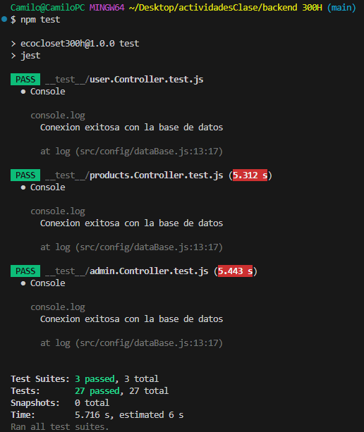

## DESCRIPCION PRUEBAS UNITARIAS EN BACKEND

Repostorio realizado para realizar pruebas unitarias con Supertest y Jest para operaciones CRUD de los controladores del Backend del proyecto final de modulo de 300H

## AUTOR
  Proyecto realizado por Camilo Fetiva para el Bootcamp de Desarrollo Web 2024  
